# 台灣天氣地圖（CWA Open Data）

類 Windy 的全螢幕互動天氣地圖：即時測站熱圖、風場粒子動畫、鄉鎮 72 小時／一週預報、雷達回波、衛星雲圖與颱風路徑。

🌐 **線上網址：<https://aiot03.vercel.app>**

## 截圖

| 溫度熱圖（即時測站 IDW 內插） | 風場粒子動畫 |
|---|---|
| 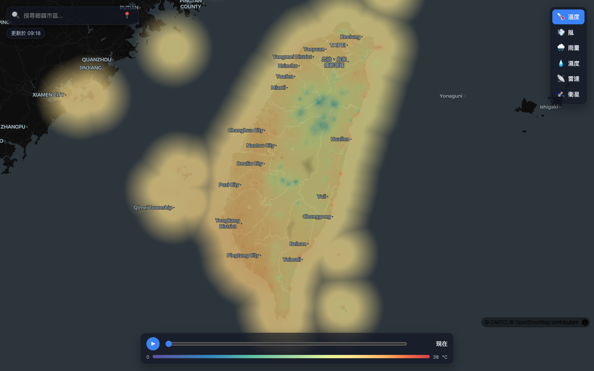 | 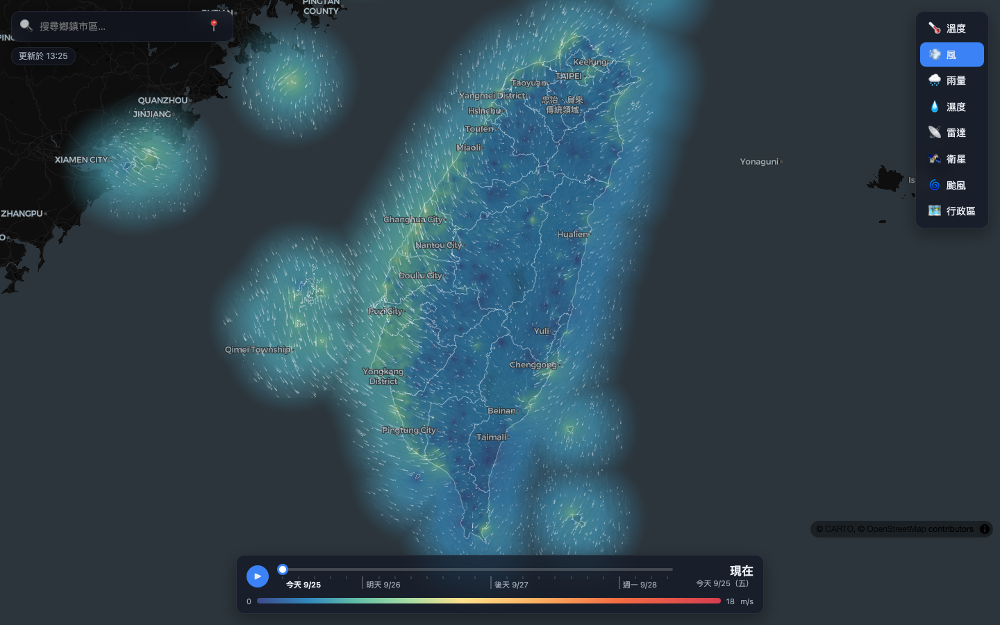 |
| **雷達回波** | **衛星雲圖（色調強化）** |
| 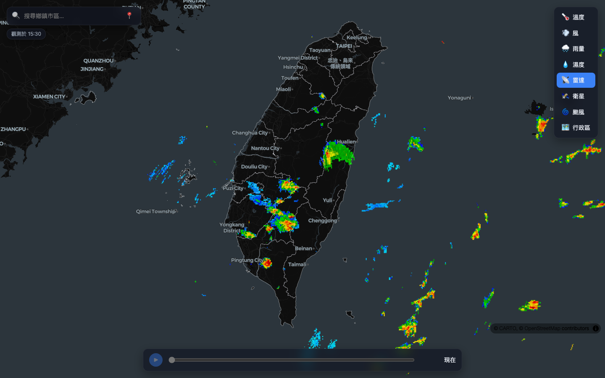 | 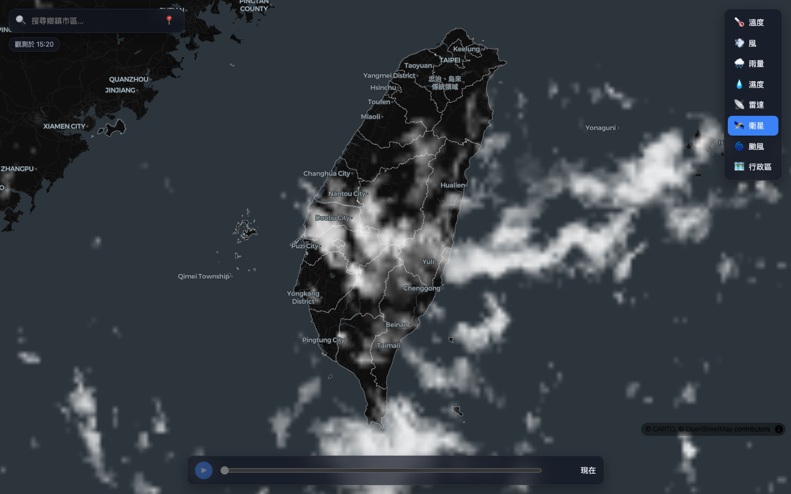 |

| 鄉鎮預報卡片（72 小時曲線＋一週預報） | 手機版 |
|---|---|
| 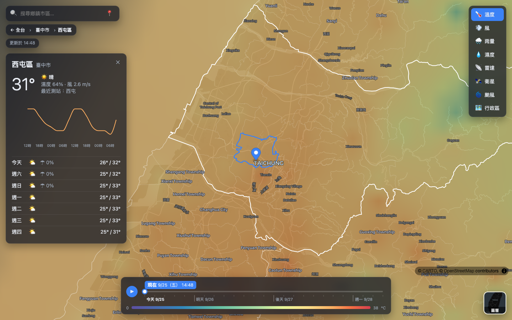 | 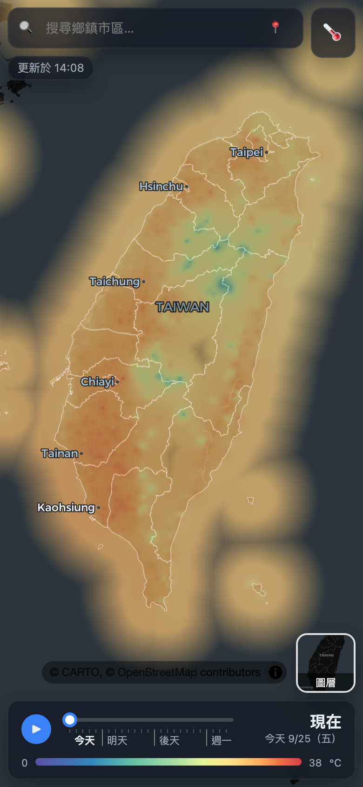 |

| 颱風路徑（過去／預測路徑、暴風圈、潛勢圓，點路徑點看數值） | 颱風（手機版） |
|---|---|
| 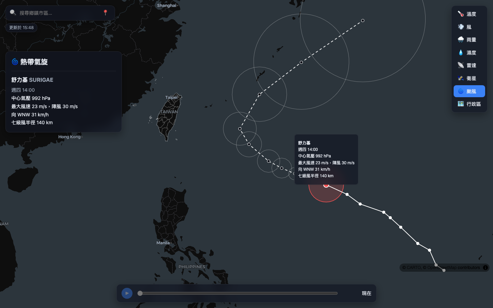 | 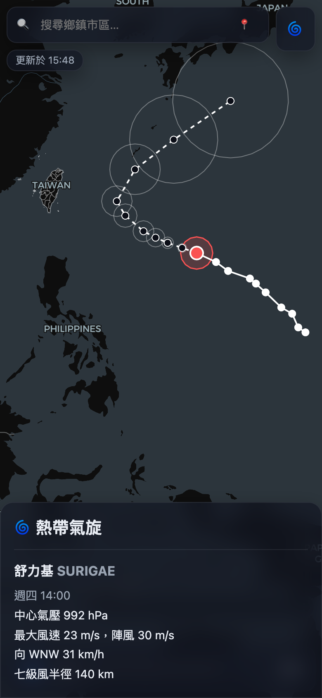 |

| 行政區（縣市／鄉鎮界線與中文名稱） | 逐層選取（點縣市再點鄉鎮，選到的區塊填色） |
|---|---|
| 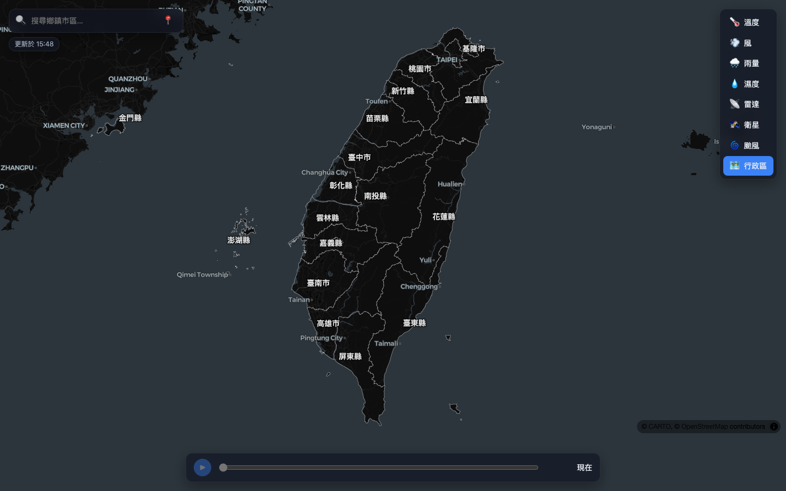 | 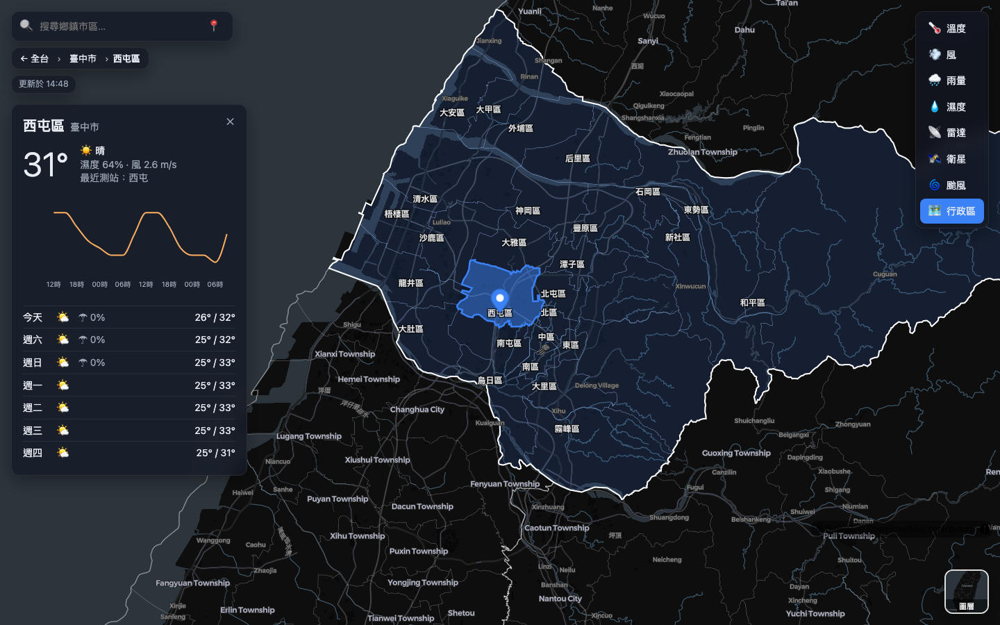 |

| 底圖切換（右下角：深色／淺色／街道／衛星／地形；圖為衛星底圖＋雷達） |
|---|
| 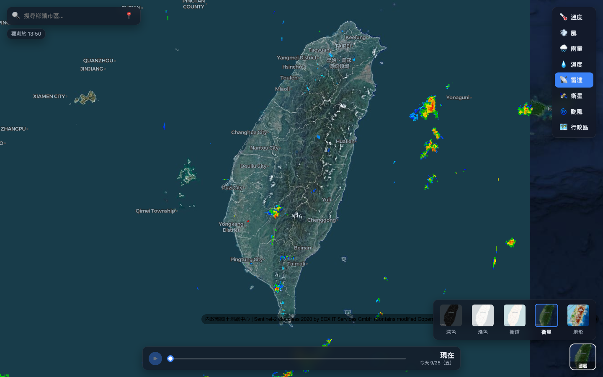 |

## 功能

- **八種圖層**：溫度、風、雨量、濕度、雷達、衛星、颱風、行政區
- **即時熱圖**：全台自動站＋人工站觀測，以反距離權重（IDW）內插成連續色階，遠離測站處淡出
- **風場粒子**：依測站風向風速內插的風場驅動粒子動畫
- **時間軸**：拖曳或播放未來 72 小時（3 小時一格），切換為鄉鎮預報分區著色；播放時在時段間線性內插、顏色平滑漸變，「現在」與預報之間淡入淡出，停下時對齊整點時段；整條日期刻度可拖曳，跟隨標籤顯示日期與時間；雷達、颱風、行政區等無時間序列的圖層不顯示時間軸
- **縣市／鄉鎮界線**：所有圖層上疊加縣市界（含海岸線）與鄉鎮界，鄉鎮界放大後才漸漸浮現
- **逐層選取**：在地圖上先點選縣市（框起並縮放過去），在該縣市內再點才選到鄉鎮；以鄉鎮多邊形判定點擊位置，搜尋框下方的麵包屑（`← 全台 › 縣市 › 鄉鎮`）可退回上一層
- **行政區圖層**：只顯示縣市／鄉鎮界線與中文名稱，不疊天氣色階；點選的縣市或鄉鎮整塊填滿藍色，選到鄉鎮時同縣市其他鄉鎮淡淡上色
- **鄉鎮查詢**：搜尋、定位或逐層點選鄉鎮，顯示目前天氣、72 小時溫度曲線與一週預報
- **雷達／衛星**：經緯度等距影像逐列重投影為 Web Mercator 後疊圖；衛星紅外線雲圖可切換「色調強化」（依雲頂溫度由灰、藍、綠、黃到紅紫上色）或白色半透明雲層
- **颱風**：活動中熱帶氣旋的過去／預測路徑、七級風暴風圈與 70% 潛勢圓，點路徑點看該時刻數值；切入時自動縮放到台灣與整條路徑
- **底圖切換**：右下角可切換深色、淺色、街道、衛星（Sentinel-2 無雲影像＋國土測繪中心正射影像）與地形（OpenTopoMap）；淺色底圖上的界線、颱風路徑與風粒子自動改用深色
- **可分享網址**：圖層、時間、鄉鎮狀態同步到 URL（例：`?layer=temp&town=66000060`）

## 系統架構

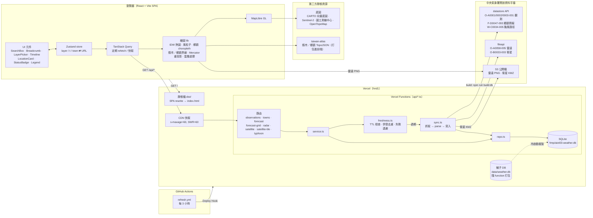

### 請求流程（快取與更新）

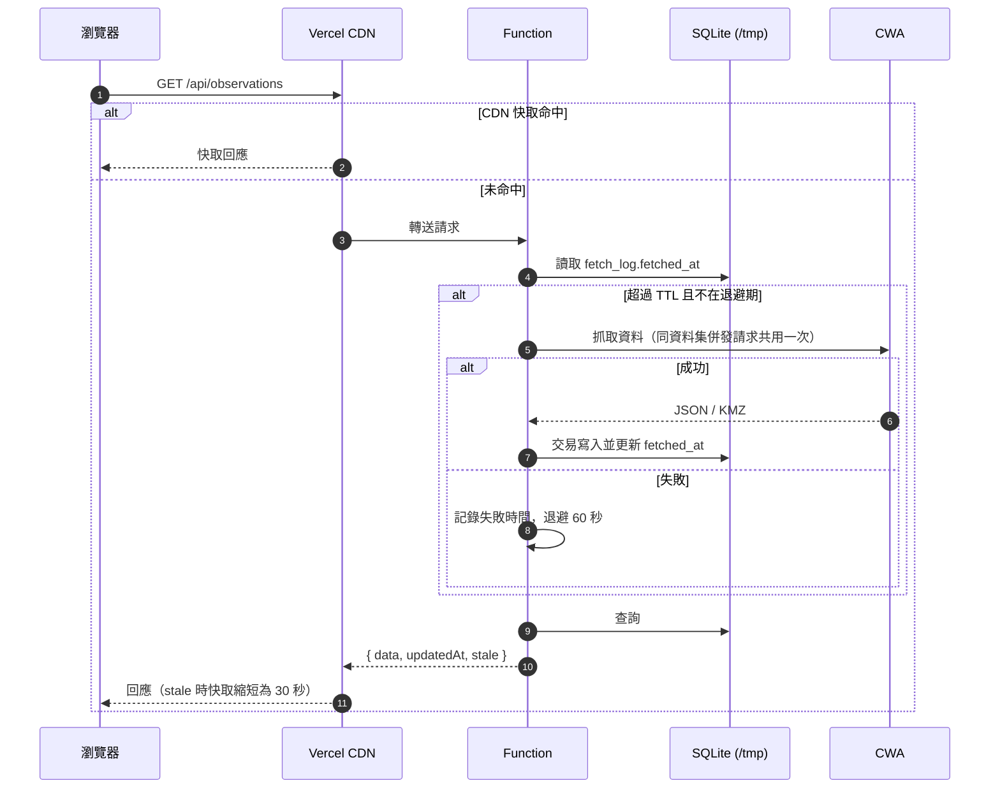

| 資料集 | TTL | 前端 refetch |
|---|---|---|
| 測站觀測 | 5 分鐘 | 5 分鐘 |
| 鄉鎮預報 | 60 分鐘 | 10 分鐘（時段清單） |
| 雷達 | 10 分鐘 | 10 分鐘 |
| 衛星 | 10 分鐘 | 10 分鐘 |
| 颱風 | 30 分鐘 | 10 分鐘 |

### 部署與種子資料

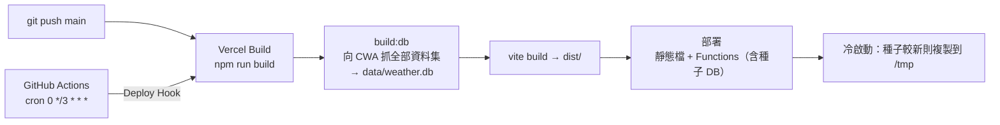

種子 DB 讓冷啟動時不必等 CWA 回應即可出圖；單一資料集抓取失敗不會中斷 build，執行期會再補抓。

## 專案結構

```
aiot03/
├── api/                  # Vercel Functions 進入點（每個檔案一個端點）
├── server/
│   ├── cwa/              # CWA client、JSON/KMZ 解析
│   ├── db.ts             # SQLite schema、種子 DB 複製到 /tmp
│   ├── freshness.ts      # TTL、併發去重、失敗退避
│   ├── sync.ts           # 各資料集抓取與寫入
│   ├── repo.ts           # SQL 查詢
│   ├── service.ts        # 組合 freshness + repo 給 api/ 使用
│   └── http.ts           # JSON 回應、Cache-Control、錯誤處理
├── shared/types.ts       # 前後端共用型別
├── frontend/src/
│   ├── components/       # MapView、DataLayers、WindParticles、Timeline、LocationCard…
│   ├── map/              # MapLibre 圖層 hooks（image overlay、choropleth）
│   ├── lib/              # IDW、色階、Mercator 重投影、雲層、URL 狀態…
│   ├── api.ts            # TanStack Query hooks
│   └── store.ts          # Zustand 狀態（與 URL 同步）
├── scripts/build-db.ts   # 建置種子 DB
├── .github/workflows/    # 每 3 小時觸發重新部署
└── vercel.json
```

## 技術棧

- 前端：React 19、Vite、MapLibre GL、TanStack Query、Zustand、Recharts、topojson-client
- 後端：Vercel Functions（Node.js 22）、better-sqlite3、fflate（解 KMZ）
- 測試：Vitest（含 CWA 回應 fixtures）
- 資料來源：[中央氣象署開放資料平臺](https://opendata.cwa.gov.tw)

## 本機開發

1. `.env` 放入 `CWA_API_KEY=你的授權碼`
2. `npm install`
3. `npm run build:db`（選用，先建種子 DB）
4. `npm run dev` → http://localhost:5173

## 測試

`npm test`、`npm run typecheck`

## 部署設定

- Vercel 環境變數：`CWA_API_KEY`
- GitHub Secret：`VERCEL_DEPLOY_HOOK`（未設定時排程會略過重新部署）

## API

| 端點 | 說明 |
|---|---|
| `GET /api/observations` | 全台最新測站觀測 |
| `GET /api/towns` | 鄉鎮清單與中心點 |
| `GET /api/forecast?town=ID` | 鄉鎮 3 小時與一週預報 |
| `GET /api/forecast-grid[?time=ISO]` | 預報時段清單與指定時段全台鄉鎮數值 |
| `GET /api/radar` | 最新雷達回波圖片資訊 |
| `GET /api/satellite` | 最新衛星雲圖圖塊清單 |
| `GET /api/satellite-tile?id=2/1/2` | 衛星雲圖圖塊（PNG，存於 SQLite） |
| `GET /api/typhoon` | 活動中熱帶氣旋的過去與預測路徑 |

所有 JSON 回應格式為 `{ data, updatedAt, stale }`，`stale: true` 表示 CWA 暫時無法更新、回傳的是舊資料。
